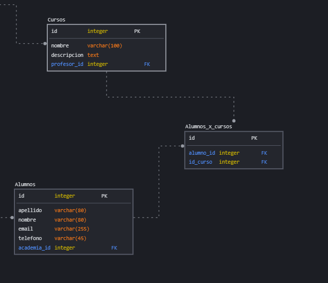
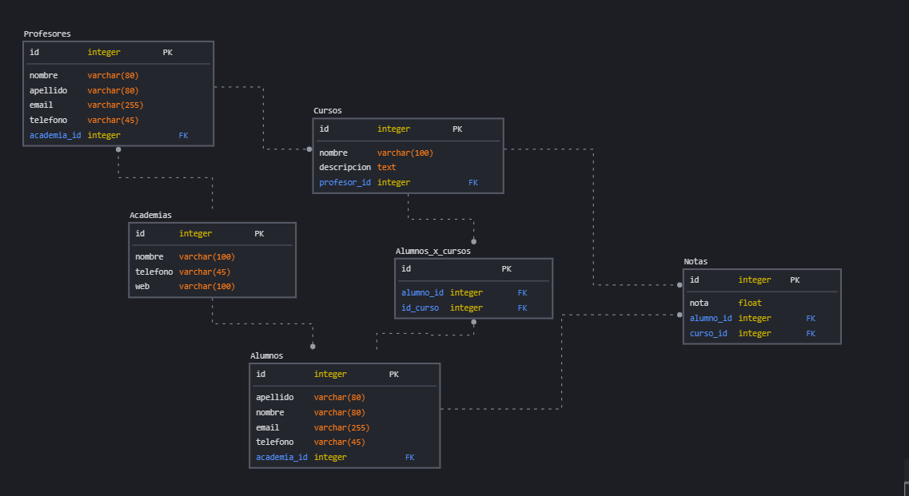

# Base de datos
## Qué es una base de datos (BD)
- Es un lugar donde podemos guardar datos de una forma ordenada.
- Al comienzo, los datos se guardaban en blogs de notas y Excels.
- Luego Empezaron a aparecer programas especializados para organizar los datos.

#### ¿Dónde se guardan los datos?
- En computadoras
- Data Centers : Es un conjunto de computadoras en un cuarto que permite proveer el servicio de base de datos
- Blockchain : Es una base de dato descentralizada . Osea que tenemos “computadoras” en todas partes del mundo y nuestra BD esta replicada en cada computadora.


#### Tipos de BD
- Se dividen en dos grupos
##### Relacionales
- Se basa en las relaciones que los datos tienen entre sí y no se tiene en cuenta su orden de almacenamiento.
- Cada tabla de una BD almacena información sobre algo (personas, perros, etc)
- Cada fila (tiene información sobre X persona / perro / etc) de una tabla, contiene una ID que suele ser un “numero único” que identifica esa fila.
- Ese “numero único” lo suelen almacenar otras tablas para hacer referencia a una “fila especifica de otra tabla”. Osea los datos se relacionan.
- Se utiliza SQL
- Bases de datos Relacionales:
   - MySql / MariaDB
   - Oracle PL/SQL
   - SQLite
   - Transact-SQL
   - WebSQL
- Ventajas:
  - Madurez: Lleva mucho tiempo en el mercado
  - Atomicidad: Si en el proceso de hacer alguna operación como crear o eliminar, surge algún error, se puede revertir la operación.
  - Estándar Bien definido: Se escribe bajo el estándar de SQL
  - Es facil de aprender.
- Desventajas:
  - Crecimiento: Cuando crecen demasiado, el mantenimiento y el almacenamiento es difícil y costoso. Suelen presentar fallas en el momento de la respuesta.
  - Son difíciles los cambios de la estructura	

##### No relacionales (NO SQL)
- Está diseñada para modelos de datos específicos.
- Tiene esquemas flexibles (se pueden modificar con facilidad las tablas) para aplicaciones modernas.
- Son fáciles de desarollar, tiene buen rendimiento y son escalables.
- Con estas bases de datos, podemos guardar los [JSON](https://fedeleva.github.io/documentacion/docs/Javascript/extra#que-es-json) Directamente.
- Son útiles cuando necesitamos “sincronizar” información.
- Bases de datos No Relacionales:
  - MongoDB
  - CouchDB
  - Firebase
  - Hadoop
  - Cassandra
  - Voldemort
- Ventajas: 
  - Es versátil: Es facil cambiar la estructura de la BD.
  - Crecimiento horizontal: Soportan escalabilidad descentralizada es decir soportan estructuras distribuidas. Se crean servidores en diferentes lugares (con las mismas BD) para mejorar el rendimiento.
  - Optimización: Tienen un algoritmo interno para rescribir las consultas escritas por el usuario o las aplicaciones programadas.
- Desventajas:
  - Atomicidad: La información en ocasiones no es consistente. Puede haber “Información distinta” en cada fila de una tabla.


## Como diseñar una BD relacional

#### 1 Paso - Identificar las tablas
- Identificar los componentes/elementos/entidades que va a tener tu sistema

:::tip Entidad
La palabra entidad es usada para hacer referencia a todo aquello que pueda ser considerado como una unidad. 
:::


- Ejemplo: Usuarios, Clientes, Productos, etc.
- Para una Academia Educativa, los componentes pueden ser:
   - Profesores
   - Alumnos
   - Cursos
   - Notas
   - Academia
   - Calificaciones
   - Materia
- Cada componente es una tabla en la BD.
#### 2 Paso - Identificar las columnas
- Cada componente tiene información específica que se quiere guardar y obviamente el identificador (ID).
- Para los Alumnos puede ser: ID, Nombre y Apellido.
- Para Las Calificaciones puede ser: Nota, ID Materia y ID Alumno.
- Esa información específica son los “atributos / propiedades / columnas”.
- Cada estudiante que se guarda en la tabla Alumnos con esa información que se especificó, es una fila de la tabla.


:::tip
- Solo se guardan datos, no cálculos.
- De los cálculos se encargan las aplicaciones.


:::

#### 3 Paso - Identificar los tipos de datos que vas a usar
- Cada columna corresponde a un tipo de dato.
- Cada BD tiene sus tipos de datos .
- Cada tipo de dato tiene: La longitud del texto o del numero y cuanto espacio de memoria se utiliza para guardar ese tipo de dato.

##### Ejemplos

|  Tipo de dato |  Tamaño/Longitud  |
| - | - |
|  Char | Entre 0 y 256 caracteres |
|  Varchar  | Entre 0 y 65.535 caracteres |
|  Int  | -2147483648 a 2147483647 |
|  Double  | Números grandes con coma |
|  Text  | Textos grandes |
|  Date  | Fecha (Año / Mes / Dia)|
|  DateTime  | Fecha y Hora|
|  TimeStamp  | Es como DateTime , pero funciona hasta el año 2038|


:::tip
En la mayoría de BD el valor booleano es un numero: Un 0 para false y un 1 para true.
:::

## Como armar el modelo de BD

- Herramientas para diseño:
 -  [sqlDBM](https://sqldbm.com/Home/)
 -  [Draw.io](https://app.diagrams.net)
 -  Enterprise Architect
 -  MySql Workbench
 -  Etc


:::tip
Estas herramientas arman el diseño (modelo), pero también pueden ofrecer otras funcionalidades como generar el código SQL, conectarse a una BD para gestionarla, ejecutar SQL, etc.s
:::

##### Ejemplos de diseños


:::tip Observación
- Se muestran todas las tablas y cada una tiene un nombre.
- Cada tabla tiene varios atributos (columnas) (Lo que se especifica adentro de la tabla).
- Las flechas muestran la relación que tiene una tabla con otra.
:::

#### Tipos de relaciones

##### De uno a uno
- Una fila de una tabla se vincula con la fila de otra tabla. 
- la  eliminación de una fila conlleva a la  eliminación de la otra.
- Se suele llamar composición.
##### De uno a muchos
- Es muy común.
- Una fila de una tabla se vincula con varias filas de otra tabla.
- En esta situación, se pone la id en él muchos. Ejemplo : id_estudiante , id_profesor , etc.


:::tip Observación
- Una academia tiene varios profesores, pero cada profesor solo permanece a una academia.
- La id es academia_id y se ubica en el muchos.
- Con academia_id identificamos a que academia pertenece el profesor.
- El valor de academia_id es el id de una fila de la tabla Academias (haciendo referencia a que permanece a esa academia).


:::

:::tip
- [Explicación de una FK (Foreign Key) y PK (Primary Key)](https://fedeleva.github.io/documentacion/docs/SQL/modificar#restricciones-de-la-tabla )

:::
##### De muchos a muchos
- Muchas filas de una tabla se vincula con muchas filas de otra tabla. 
- En esta situación, se suele utilizar una tercera tabla que represente la relación. 
- Esta tabla tendrá la id de las dos filas. Ejemplo: id_profesor y id_estudiante.
- Se suele llamar asociación.



:::tip Observación
- Un alumno puede cursar varios cursos y un curso puede tener varios alumnos.
- En esta relación, se crea una tabla intermedia, que en este ejemplo se llama                                    “Alumnos_x_cursos”
:::


##### Y hay muchas otras relaciones.


:::tip
- Para los nombres de los atributos, tablas, base de datos, etc, se usa snake_case
- Cada tabla, debe tener como atributo un id (identificador único)
:::

#### Ejemplo Modelo



#### Código SQL para crear el modelo

```sql
CREATE TABLE Academias
(
 id       integer NOT NULL,
 nombre   varchar(100) NOT NULL,
 telefono varchar(45) NOT NULL,
 web      varchar(100) NOT NULL,

 CONSTRAINT PK_1 PRIMARY KEY ( id )
);


CREATE TABLE Alumnos
(
 id          integer NOT NULL,
 apellido    varchar(80) NOT NULL,
 nombre      varchar(80) NOT NULL,
 email       varchar(255) NOT NULL,
 telefono    varchar(45) NOT NULL,
 academia_id integer NOT NULL,

 CONSTRAINT PK_1 PRIMARY KEY ( id ),
 CONSTRAINT FK_2 FOREIGN KEY ( academia_id ) REFERENCES Academias ( id )
);

CREATE TABLE Alumnos_x_cursos
(
 id         NOT NULL,
 alumno_id integer NOT NULL,
 id_curso  integer NOT NULL,

 CONSTRAINT PK_1 PRIMARY KEY ( id ),
 CONSTRAINT FK_4 FOREIGN KEY ( alumno_id ) REFERENCES Alumnos ( id ),
 CONSTRAINT FK_5 FOREIGN KEY ( id_curso ) REFERENCES Cursos ( id )
);

CREATE TABLE Cursos
(
 id          integer NOT NULL,
 nombre      varchar(100) NOT NULL,
 descripcion text NOT NULL,
 profesor_id integer NOT NULL,

 CONSTRAINT PK_1 PRIMARY KEY ( id ),
 CONSTRAINT FK_3 FOREIGN KEY ( profesor_id ) REFERENCES Profesores ( id )
);

CREATE TABLE Notas
(
 id        integer NOT NULL,
 nota      float NOT NULL,
 alumno_id integer NOT NULL,
 curso_id  integer NOT NULL,

 CONSTRAINT PK_1 PRIMARY KEY ( id ),
 CONSTRAINT FK_6 FOREIGN KEY ( alumno_id ) REFERENCES Alumnos ( id ),
 CONSTRAINT FK_7 FOREIGN KEY ( curso_id ) REFERENCES Cursos ( id )
);


CREATE TABLE Profesores
(
 id          integer NOT NULL,
 nombre      varchar(80) NOT NULL,
 apellido    varchar(80) NOT NULL,
 email       varchar(255) NOT NULL,
 telefono    varchar(45) NOT NULL,
 academia_id integer NOT NULL,

 CONSTRAINT PK_1 PRIMARY KEY ( id ),
 CONSTRAINT FK_1 FOREIGN KEY ( academia_id ) REFERENCES Academias ( id )
);


```

## PhpMyAdmin
- PhpMyAdmin es una aplicación web que sirve para administrar bases de datos MySQL de forma sencilla y con una interfaz amistosa. Se trata de un software muy popular basado en PHP.
- Con phpMyAdmin puedes hacer todo tipo de operaciones, desde la creación y borrado de bases de datos a la administración de las tablas (crear, modificar y eliminar) y, por supuesto, de sus propios datos.
- Para usar phpMyAdmin simplemente necesitas subir el conjunto de archivos PHP que componen la aplicación a un servidor web, configurar con los datos de acceso a MySQL y empezar a administrar las bases de datos.
- Tiene un apartado llamado SQL para ejecutar código SQL, si no queres usar la interfaz.
- Viene incluido en los cPanel del hosting y en algunos entornos de desarrollo como XAMPP.

#### Xampp
1. Instalamos el [xampp](https://www.apachefriends.org/es/index.html)
2. Activamos el Apache (Servidor Web HTTP) y MySQL (Para las BD).
3. Luego en el navegador , entramos al localhost y luego a phpMyAdmin a traves del menu (El link seria "http://localhost/phpmyadmin").
4. A la izquierda tenes todas las bases de datos, creamos una nueva tocando “Nueva”.

#### Datos de la BD
- Nombre: academias
- Tipo de dato: utf8-bin (Es el tipo de caracteres que se usara para guardar los valores en la BD)
- Le damos a Create (crear).


:::tip
Esto se puede hacer con código SQL, pero lo hicimos con la interfaz de PhpMyAdmin.
:::

#### Orden para cargar(crear) las tablas
###
##### 1- Las tablas que no tienen FK
-  Primero creamos la tabla academias con 4 columnas.


:::tip ¿Como crear una tabla?
- Seleccionando la base de datos que creamos en el menu vertical de la izquierda, le damos a crear tabla.
- Ponemos el nombre de la tabla.
- Ponemos el nombre de las columnas  con sus tipos de datos y longitudes (lo que esta entre parentesis en el modelo).
- Por ultimo le damos a guardar.
:::
  
:::tip
Si le das a A_I (Auto_incremetal) , hará que el valor se asigne solo , en la primera fila su valor será 1 , en la segunda fila su valor será 2 y se ira incrementando de esta forma. También hará que la columna esta PK.

:::

##### 2-	Cualquier tabla que solo contenga academia_id(fk)
- Creamos cualquier tabla que haga referencia a una fila de la tabla que creamos primero (Academias)
- En este paso, creamos la tabla profesores (6 columnas) y alumnos (6 columnas).


:::tip ¿Cómo crear las FK?
- Vamos a crearle una  FK a la tabla profesor.
1. Hacemos click en la tabla profesores (menu vertical de la izquierda).
2. Le damos a Estructura – Vista de Relaciones y en ese apartado podés crear las FK.
- Para crear una relación(restricciones) se tiene que especificar:
   - Nombre : Puede ser cualquier texto . En este caso academia_fk. Con el nombre que especificamos modificamos la FK. Se suele utilizar fk en alguna parte del nombre para especificar que es fk.
   - La columna que va a ser FK. Osea la columna que su valor va a ser igual a la ID de la otra tabla. En este caso academia_id.
   - El nombre de la BD de la otra tabla(la que contiene la PK , la ID). En este caso academias (en esta BD esta creada la tabla academia).
   - El nombre de la otra tabla (La que contiene la PK, La ID) : En este caso academias , ya que el valor de la ID de alguna fila de esta tabla , se debe asignar al valor de academia_id de la tabla profesores. 
   - El nombre de la columna de la otra tabla que contiene el ID: Por defecto es id.
:::


:::tip ¿Qué pasa si eliminamos una academia que tiene profesores?
- Con ON DELETE especificamos que acción hacer.
- ON DELETE Restrict : Si se elimina una Academia , va a lanzar un error y no se va a poder.
- ON DELETE Cascade : Si se elimina una Academia , se va a eliminar todos los profesores que tenga.
- ON DELETE SET Null: Si se elimina una Academia, el valor de academia_id será null para todos los profesores.
- ON DELETE NO ACTION: Como dice el nombre, no realizara ninguna acción, si se borra la academia.
:::

:::tip ON UPDATE
- Con ON UPDATE especificamos que acción hacer si se modifica la academia.
:::

:::tip Eliminación Lógica
- Generalmente, usamos un soft Delete o una eliminación lógica.
- Que consiste en poner un atributo/propiedad booleana que especifique si esta eliminado o no.
- Si es true, es porque esta eliminado y no se le mostrará al usuario la “fila (el profesor en este caso)”, pero seguirá guardado en la BD.
- Si es false, es porque no está eliminado.


:::


- Creamos la tabla Alumnos de la misma forma que la tabla Profesores.

:::tip
- El nombre de la restricción (fk) debe ser único.
- No se puede repetir en dos tablas diferentes.


:::


##### 3- Cualquier tabla que tenga una referencia (FK) a una fila de la tabla academias (con academia_id), alumnos (con id_alumno) y profesor (con id_profesor).

- En esta creamos la tabla Cursos.


:::tip
Evitar tildes y caracteres raro en el nombre de las columnas.

:::

##### 4- 	Cualquier tabla que tenga una referencia de academia_id , id_alumno , id_profesor o una referencia de  una fila de la tabla Cursos (curso_id).

- Creamos la tabla notas y  alumnos_x_cursos

##### ¡Listo! Ya la tenemos.

- Podes hacer operaciones con las opciones que te brinda PhpMyAdmin para testear la BD que creamos.
  
:::tip Opciones de PhpMyAdmin
- Con la opcion Insert podes insertar filas a las tablas que creamos.
- Con la opcion SQL ejecutas código SQL
- Con la opcion Export , exportas.
- Y hay muchas mas opciones.
- Si tocas esas opciones, estando ubicado en una tabla, solo se aplicará la acción en la tabla.
- Si tocas esas opciones, estando ubicado en una base de dato, se aplicará la acción en todas las tablas de la BD

:::

## SQL
- Significa “Structured Query Language” que en español seria Lenguaje de consulta estructurado.
- Es un lenguaje que nos permite modificar y crear:
   -	Bases de datos
   -	Tablas
   -	Restricciones
   -	Datos
   -	etc
- Es un lenguaje NO UNA BASE DE DATOS, que nos permite manipular una base de datos relacional.
- El lenguaje vario un poco en cada base de datos, por eso hay que leer la documentación.


#### Tipos de consultas
- La vamos a dividir en dos categorías

##### 1- Estructuras de la base de datos

| Comando | Explicación |
| - | - |
| CREATE DATABASE | Crear Base de datos  |
| DROP DATABASE | Eliminar Base de datos  |
| CREATE TABLE | Crear tablas  |
| ALTER TABLE | Modificar tablas  |
| DROP TABLE | Eliminar tablas  |

##### 2- Consultando y Modificando los datos

| Comando | Explicación |
| - | - |
| SELECT | Buscar   |
| INSERT | Agregar  |
| UPDATE | Modificar  |
| DELETE | Eliminar  |

##### Hay más tipos de consultas , pero estas dos son las básicas.


#### Comandos SQL
##### Crear BD
```sql
CREATE DATABASE nombre_de_la_BD;
```
##### Eliminar BD
```sql
DROP DATABASE IF EXISTS nombre_de_la_BD;
```
:::tip
La palabra "IF EXISTS" es opcional , sirve para validar que la base de datos exista antes de que se elimine. SI no existe, no se ejecutará el comando.
:::


##### Seleccionar una BD
```sql
USE nombreBD;
```
:::tip
Todas las operaciones que se hagan, se harán en la BD que seleccionaste con este comando.
:::

##### Crear una tabla
- Depende de donde estes ubicado hay dos formas.

- Primera forma: 	Seleccionar la BD y luego crear la tabla :
```sql
USE nombreBD;
CREATE TABLE  nombre_tabla(
Nombre_columna tipo_de_dato(longitud) restricción restricción … ,
Nombre_columna tipo_de_dato(longitud) restricción restricción … ,
… ,
Restricción(Como primary key, foreign key, etc) ,
Restricción (Como primary key, foreign key, etc) ,
...
);

```
- Segunda forma: Crear la tabla directamente:
```sql
CREATE TABLE  nombreBD.nombre_tabla(
Nombre_columna tipo_de_dato(longitud) restricción restricción … ,
Nombre_columna tipo_de_dato(longitud) restricción restricción … ,
… ,
Restricción(Como primary key, foreign key, etc) ,
Restricción (Como primary key, foreign key, etc) ,
…
);

```

:::tip Observación
- Siempre se ubica un punto y coma (“;”) al final, que indica que ahí se terminó el comando.
- Todas las columnas y sus restricciones se ubican entre paréntesis (“()”).
- Cada columna está separada por una coma (“,).
- Despues de definirse las columnas, podes especificar restricciones como primary key, foreign key, etc.


:::


##### Eliminar una tabla

```sql
DROP TABLE IF EXISTS nombre_tabla
```

:::tip
La palabra "IF EXISTS" es opcional , sirve para validar que la tabla exista antes de que se elimine. SI no existe, no se ejecutará el comando.
:::

##### Agregar columnas

```sql
ALTER TABLE nombre_tabla ADD COLUMN nombre_columna tipo_de_dato(longitud) restricción  restricción …;
```
##### Eliminar columnas
```sql
ALTER TABLE nombre_tabla DROP nombre_columna;
```
##### Modificar Columnas

```sql
ALTER TABLE nombre_tabla ALTER COLUMN nombre_columna tipo_de_dato(longitud) restricción restricción …;
```
:::danger
- Si modificas la longitud, se “recortara (modificara)” todos los datos que sobrepasen la nueva longitud, para adecuarse a esta.
- Conclusión: Al modificar la longitud, podes perder datos.


:::

##### Agregar una fila

```sql
INSERT INTO nombre_tabla ( nombre_columna_1 , nombre_columna_2 , …) VALUES (valor_columna_1 , valor_columna_2 , …)
```

:::tip
- Si omitis la parte "( nombre_columna_1 , nombre_columna_2 , …) ,tenes que especificar todos los valores en VALUES (Desde la primera columna hasta la última, se respeta el orden de la tabla).
:::

- Podes añadir datos a X columna, no hace falta siempre empezar por la primera o tener que llenar todas las columnas.

```sql
INSERT INTO nombre_tabla (nombre_columna_x , nombre_columna_y , ) VALUES (valor_columna_x , valor_columna_y , …)
```

:::tip
- Si el valor es texto, se usa comillas simples o doble.
- Es como cualquier lenguaje de progamación.


:::

##### Eliminar una fila
```sql
DELETE FROM nombre_tabla WHERE nombre_columna = X;
```

:::tip Observación
- Se elimina la fila cuyo nombre_columna tenga el valor X.
- Nombre_columna suele ser la ID.
- Si no especificas el WHERE, se eliminan todas las filas de la tabla.


:::

##### Modificar una fila

```sql
UPDATE nombre_tabla SET nombre_columna = valor  , nombre_columna = valor , … WHERE nombre_columna = X;
```


:::tip Observación
- Solo se modifican las columnas que se especifican despues del SET.
- Cada columna que se modifica, está separada por una coma (“,”).
- Se modifica la fila cuyo nombre_columna tenga el valor X en el WHERE.
- Nombre_columna suele ser la ID.
- Si no especificas el WHERE, se modifican todas las filas de la tabla.


:::

##### Consultas datos
- Buscar todas las filas de una tabla:

```sql
SELECT * FROM nombre_tabla;
```

- Filtrar filas:

```sql
SELECT * FROM nombre_tabla WHERE nombre_columna = Valor;
```
:::tip Observación
Buscamos todas las filas cuyo nombre_columna tenga el Valor que se especifico.

:::

- Buscar solo algunas columnas especificas:

```sql
SELECT nombre_columna , nombre_columna , … FROM nombre_tabla;
```

- Le podes añadir el WHERE también, para buscar en base a una columna.


```sql
SELECT nombre_columna , nombre_columna , … FROM nombre_tabla WHERE nombre_columna = valor;
```

:::tip Observación
- El WHERE se encarga de buscar solo las filas que cumplen con una condición.
- El WHERE trabaja con valores booleanos entonces, solo busca las filas cuya condición es true (se cumple).
- Por lo tanto, utiliza los mismos operadores relacionales que un lenguaje de progamación.


:::


:::tip info
- [WHERE](https://fedeleva.github.io/documentacion/docs/SQL/where )
- [RESTRICCIONES DE LAS TABLAS](https://fedeleva.github.io/documentacion/docs/SQL/modificar#restricciones-de-la-tabla)
- [Guia sql](https://fedeleva.github.io/documentacion/docs/SQL)
:::

#### ¡Bueno, Ahora proba todas las consultas en [sqlfiddle](http://sqlfiddle.com/#!9/9eecb ) para ponerlo en práctica! 


## BD en C#
- Vamos a modificar el [ejemplo  Gestion de Cliente](./POO.md#ejemplo---gestion-de-cliente), para conectarla a una BD.


:::tip ¿Qué BD vamos a usar?
- SQlite: Si solo se usa una PC y hay un solo usuario. El sistema no necesita internet ni estar conectado a una red. Esta todo en una misma computadora.
- MSQL:  Si hay muchos usuarios. Hay un servidor que levanta la BD y todas las PC apuntan a ese servidor.
:::


#### En PhpMyAdmin
1. Creamos la BD clientes en PHPMYADMIN
2. Creamos la tabla cliente con 5 columnas (la ID + los 4 datos que se necesita para crear un cliente).

- La tabla cliente quedaria con 5 columnas:
   - id (int) auto_incremental PK
   - nombre  varchar(100)
   - apellido varchar(100)
   - teléfono varchar(40)
   - tarjeta_de_credito varchar(30)


#### Ordenamos los archivos

##### Carpeta Models o "Entities"
- Todas las clases que se usan para guardar datos en BD, se suelen decir “modelos” o “entidades”.
- En el explorador de soluciones, añadimos una carpeta nueva (Seleccionamos el proyecto – agregar – nueva carpeta) al proyecto llamada “models” o “entities”.
- Añadimos la clase Cliente (Cliente.cs) adentro de la carpeta (solo arrastramos el archivo a la carpeta).

:::tip
- Un Modelo representa una tabla de la BD.
- Cada propiedad del modelo es una columna de la tabla.

:::

##### Carpeta "Forms" o "Views"
- Los formularios (Windows Form), se suelen guardar en una carpeta llamada “formularios” o “vistas”.
- En el explorador de soluciones, añadimos una carpeta nueva al proyecto llamada “forms”.
- Añadimos las clases correspondiente a los formularios a la carpeta (Menu.cs y GestionUsuario.cs).

:::tip
- Un formularios o vista representa una interfaz de usuario.

:::

### Conexión y Select

#### Carpeta DAO
- Por último, creamos una carpeta llamada “dao” (es la abreviación de “Data Access Object”).
- En esta carpeta van las clases que tienen una conexión directa con la BD.
- Por ejemplo, en esta carpeta se ubica la clase que establece una conexión con la BD.

:::tip ¿Qué es una Clase DTO?
- Cada una de estas clases representa datos que se mandarán al usuario.
- Contiene los datos que  se mostraran al usuario.
:::

#### Instalamos un Plugin
1. Click derecho en el nombre del proyecto – Administrar Paquetes Nuget (Esta es el apartado para gestionar plugins (funcionalidades)).
2. Hacemos click en  Browse y buscamos mysql.
3. Instalamos MySql.Data.


:::tip ¿Qué es un plugin?
- Un plugin es una aplicación o complemento a un código principal con el que se añaden funcionalidades extra y mejoras al funcionamiento de dicho código.
- Un complemento informático, también conocido como plug-in, es una aplicación que permite extender las funciones de otra aplicación o programa sin tener que modificar el código. 
:::
#### Creamos la Clase ClienteDao.cs
- Seleccionamos la carpeta DAO, click derecho – Agregar – Clase (Esta clase esta adentro de la carpeta dao).
- Esta clase gestionara el acceso a la BD.
- Contenido de la clase:


```csharp
using MySql.Data.MySqlClient;

namespace GestionDeFacturas.dao
{
    internal class ClienteDao
    {
        public void Conectar()
        {
            // Ubicación del servidor
            // Es un numero IP IPv4 o localhost (entorno local)
            // En windows , podemos acceder a la ip con el comando "ipconfig" en la consola.
            string servidor = "localhost";
            // Usuario de la BD
            string usuario = "root";
            // Contraseña del usuario
            string password = "";
            // El nombre de la BD a la que se va a conectar
            string baseDeDatos = "Clientes";
            // El string para establecer una conexion
            string cadenaConexion = "Database=" + baseDeDatos + "; Data Source=" + servidor + "; User Id=" + usuario + "; Password=" + password + "";
            // Establecemos la conexion a la BD
            // Este objeto tiene los metodos para manipular la base de dato.
            // Con este objeto podemos crear/leer/modificar/eliminar tablas , filas , etc.
            MySqlConnection conexionDb = new MySqlConnection(cadenaConexion);
            // Abrimos la conexion a la BD
            conexionDb.Open();

            string consulta = "SELECT * FROM clientes";
            // Creamos el comando
            MySqlCommand comando = new MySqlCommand(consulta);
            // Conectamos el comando con la BD
            comando.Connection = conexionDb;
            // Ejecutamos el comando y almacenamos la respuesta en una variable  cuyo tipo de dato es MySqlDataReader
            MySqlDataReader lectura = comando.ExecuteReader();

            // En esta variable guardamos los resultados;
            string resultado = "";
            // Leemos todas las filas
            // lectura.Read() lee la siguiente fila.
            // Si no hay mas filas , devuelve false
            while (lectura.Read())
            {
                // Es lo mismo que resultado = resultado + lectura.GetString(0).
                //Con  lectura.getString(0) obtenemos como string el valor de la columna 0 de la fila.
                // En progamación , se arranca desde 0 y no por el 1.
                resultado += lectura.GetString(0);
            }

            string breakPoint = resultado;
        }
    }
}

```

:::tip Observación
- Las funciones o métodos públicos empiezan en Mayúscula. 
- Con la palabra “void” especificamos que no retorna/devuelve nada.
- Con la palabra “using” estamos importando una funcionalidad (o archivo), en este caso el plugin que instalamos.
- Cuando ejecutamos comandos SQL, abrimos la conexión a la BD.
- Cuando terminamos de ejecutar comandos SQL, cerramos la conexión. (Nos faltó hacerlo).


:::

#### Prueba el código
1. Inserta filas en la tabla con PhpMyAdmin.
2. En el programa (en alguna lógica de hacer click), instancie un objeto de esta clase e invoque el método Conectar().
3. Ejecuta el programa en modo depuración, de modo que frene en la variable breakPoint (“string breakPoint = resultado;”).
4. Chequea el valor de la variable resultado cuando se interrumpa el progama.


#### ¡Bueno ahora sí, a continuar! 
#### En la clase ClienteDao.cs


```csharp
using GestionDeFacturas.models;
using MySql.Data.MySqlClient;

namespace GestionDeFacturas.dao
{
    internal class ClienteDao
    {
        public MySqlConnection Conectar()
        {
            // Ubicación del servidor
            // Es un numero IP IPv4 o localhost (entorno local)
            // En windows , podemos acceder a la ip con el comando "ipconfig" en la consola.
            string servidor = "localhost";
            // Usuario de la BD
            string usuario = "root";
            // Contraseña del usuario
            string password = "";
            // El nombre de la BD a la que se va a conectar
            string baseDeDatos = "Clientes";
            // El string para establecer una conexion
            string cadenaConexion = "Database=" + baseDeDatos + "; Data Source=" + servidor + "; User Id=" + usuario + "; Password=" + password + "";
            // Establecemos la conexion a la BD
            // Este objeto tiene los metodos para manipular la base de dato.
            // Con este objeto podemos crear/leer/modificar/eliminar tablas , filas , etc.
            MySqlConnection conexionDb = new MySqlConnection(cadenaConexion);
            // Abrimos la conexion a la BD
            conexionDb.Open();


            return conexionDb;


        }

        public List<Cliente> ObtenerlistadoDeClientes()
        {
            List<Cliente> lista = new List<Cliente>();
            string consulta = "SELECT * FROM clientes";
            // Creamos el comando
            MySqlCommand comando = new MySqlCommand(consulta);
            // Conectamos el comando con la BD
            comando.Connection = Conectar();
            // Ejecutamos el comando y almacenamos la respuesta en una variable  cuyo tipo de dato es MySqlDataReader
            MySqlDataReader lectura = comando.ExecuteReader();

   
            // Leemos todas las filas
            // lectura.Read() lee la siguiente fila.
            // Si no hay mas filas , devuelve false
            while (lectura.Read())
            {
                Cliente cliente = new Cliente();

                cliente.Nombre = lectura.GetString("nombre");
                cliente.Apellido = lectura.GetString("apellido");
                cliente.Telefono = lectura.GetString("telefono");
                cliente.TarjetaCredito = lectura.GetString("tarjeta_de_credito");
                lista.Add(cliente);
            }

            return lista;
        }
    }
}

```
:::tip Observación
- Con Objeto_de_tipo_MySqlDataReader.GetString("X") , obtenemos el valor de la columna X como String.

:::

#### Prueba el código
1. En el programa (en alguna lógica de hacer click), instancie un objeto de esta clase e invoque el método ObtenerlistadoDeClientes() .
2. Ejecuta el programa en modo depuración, de modo que frene cuando se retorna la lista (“return lista;” ).
3. Chequea el valor de la variable lista cuando se interrumpa el programa.

:::tip
Es importante probar cada “fragmento” del código, para verificar que todo funcione correctamente y no tengamos errores.

:::

#### ¡Bueno ahora sí, a continuar! 
#### Abrimos el GestionUsuarios.cs
- Hacemos click en el formulario (en la ventana, no en un elemento) , de esta forma se nos generara un método que se ejecutara cuando cargue por primera vez el formulario.
- Este método contendra la siguiente lógica:
  
```csharp
     private void GestionUsuarios_Load(object sender, EventArgs e)
        {
            actualizarLista();
        }

        private void actualizarLista()
        {
            ClienteDao dao = new ClienteDao();
            List<Cliente> listaDb = dao.ObtenerlistadoDeClientes();
            listClientes.Items.Clear();
            for (int i = 0; i < listaDb.Count; i++)
            {
                Cliente cliente = listaDb[i];
                listClientes.Items.Add(cliente);
            }
        }

```
:::tip Observación
- Las funciones/metodos  privadas empiezan en Minuscula.
- Con elemento-ListBox.Items.Clear() , eliminamos todos los ítems de la lista.
:::

### Create
- En la lógica de hacer click en el  boton guardar:

```csharp
    private void btnGuardar_Click(object sender, EventArgs e)
        {
     


             // Creamos un objeto a partir de la clase Cliente
            Cliente cliente = new Cliente();
            // Usamos los get que creamos
            cliente.Nombre = txtNombre.Text;
            cliente.Apellido = txtApellido.Text;
            cliente.TarjetaCredito = txtTarjeta.Text;
            cliente.Telefono = txtTelefono.Text;
            ClienteDao  baseDeDatos = new ClienteDao();
            baseDeDatos.Guardar(cliente);
            actualizarLista();
        }

```

:::tip Observación
- Te lo va a marcar como un error, porque el método no está creado.
- Una de las opciones que te brinda Visual studio para corregir el error, es crearlo.
- Entonces, manteniendo la tecla control, hacemos click en Guardar(cliente); y nos dirigimos al método que creo visual studio


:::

:::tip
Al mantener la tecla control, podemos hacer click en algún método/propiedad/etc para poder dirigirnos al código que nos muestra como fue creado.
:::


#### Creamos el método guardar, en la clase ClienteDao
- En ClienteDao.cs:

```csharp
    public List<Cliente> ObtenerlistadoDeClientes()
        {
            List<Cliente> lista = new List<Cliente>();
            string consulta = "SELECT * FROM clientes";
            // Creamos el comando
            MySqlCommand comando = new MySqlCommand(consulta);
            // Conectamos el comando con la BD
            comando.Connection = Conectar();
            // Ejecutamos el comando y almacenamos la respuesta en una variable  cuyo tipo de dato es MySqlDataReader
            MySqlDataReader lectura = comando.ExecuteReader();

   
            // Leemos todas las filas
            // lectura.Read() lee la siguiente fila.
            // Si no hay mas filas , devuelve false
            while (lectura.Read())
            {
                Cliente cliente = new Cliente();

                cliente.Nombre = lectura.GetString("nombre");
                cliente.Apellido = lectura.GetString("apellido");
                cliente.Telefono = lectura.GetString("telefono");
                cliente.TarjetaCredito = lectura.GetString("tarjeta_de_credito");
                lista.Add(cliente);
            }
            // Cerramos la conexion a la BD
            comando.Connection.Close();
            return lista;
        }

        public void Guardar(Cliente cliente)
        {
            // Este es el codigo SQL que se ejecutara
            string consulta = "INSERT INTO `clientes`(`nombre`, `apellido`, `telefono`, `tarjeta_de_credito`) VALUES " +
                "('"+cliente.Nombre+"','"+cliente.Apellido+"','"+cliente.Telefono+"','"+cliente.TarjetaCredito+"')";
            // Creamos el comando
            MySqlCommand comando = new MySqlCommand(consulta);
            comando.Connection = Conectar();
            // Ejecutamos el comando 
            comando.ExecuteNonQuery();
            // Cerramos la conexion a la BD
            comando.Connection.Close();
        }

```

:::tip Observación
- Al método ObtenerlistadoDeClientes lo modificamos para que se cierre la conexión a la BD.
- El método Guardar solo ejecuta una consulta SQL (un String concatenado).


:::

### Delete
- Lógica en el boton de eliminar:


```csharp
   private void button1_Click(object sender, EventArgs e)
        {
        // Con los parentesis , especificamos que lo que tenga listClientes.SelectedItem, se convierta en una instancia de la clase Cliente
        Cliente cliente =  (Cliente)listClientes.SelectedItem;
            ClienteDao baseDeDatos = new ClienteDao();
            baseDeDatos.Eliminar(cliente);
            actualizarLista();
        }
```

:::tip Observación
- Con Elemento-ListBox.SelectedItem , obtenemos  el valor que seleccionamos en el elemento ListBox.

:::

#### Modificamos la clase Cliente.cs
- Primero tenemos que acceder a la id , para saber que cliente tenemos que eliminar.
- Entonces en la clase Cliente.cs:


```csharp
using System;
using System.Collections.Generic;
using System.Linq;
using System.Text;
using System.Threading.Tasks;

namespace GestionDeFacturas.models
{
    internal class Cliente
    {
        // Definimos las propiedades
        // Sintaxis: acceso tipo-de-dato  nombrePropiedad;
        private string nombre;


        // Creamos los metodos getter y setter de la propiedad nombre
        // Estos metodos figuran como la  propiedad "Nombre" del objeto.
        public string Nombre
        {
            // Obtenemos el valor de la propiedad nombre (get)
            get { return nombre; }
            // Modificamos el valor de la propiedad nombre (set)
            // El parametro "value" se genera solo , no hace falta especificarlo.

            set { nombre = value; }
        }


        // Otra alternativa de crear los metedos getter y setter
        // De esta forma creamos el get y set de la propiedad apellido.
        // Estos metodos figuran como la  propiedad "Apellido" del objeto.
        // Cuando lo definimos con esta alternativa , no hace falta declarar la variable/propiedad.
        public string Apellido { get; set; }
        public string Id { get; set; }
        public string Telefono { get; set; }
        public string TarjetaCredito { get; set; }
        // Un getter solo
        //Figura como la propiedad "NombreCompleto" del objeto.
        public string NombreCompleto
        {
            get { return nombre + " " + Apellido; }
        }

        // Con la palabra "override" especificamos que  remplazamos(modificamos)  el metodo que ya estaba definido (creado) (en este caso remplazamos
        // ToString() que ya venia , con el nuevo (el que definimos abajo))
        public override string ToString()
        {
            return NombreCompleto;
        }
    }


}

```


#### Tenemos que crear el método eliminar, en la clase ClienteDao
- En ClienteDao.cs:


```csharp
public List<Cliente> ObtenerlistadoDeClientes()
        {
            List<Cliente> lista = new List<Cliente>();
            string consulta = "SELECT * FROM clientes";
            // Creamos el comando
            MySqlCommand comando = new MySqlCommand(consulta);
            // Conectamos el comando con la BD
            comando.Connection = Conectar();
            // Ejecutamos el comando y almacenamos la respuesta en una variable  cuyo tipo de dato es MySqlDataReader
            MySqlDataReader lectura = comando.ExecuteReader();

   
            // Leemos todas las filas
            // lectura.Read() lee la siguiente fila.
            // Si no hay mas filas , devuelve false
            while (lectura.Read())
            {
                Cliente cliente = new Cliente();
                cliente.Id = lectura.GetString("id");
                cliente.Nombre = lectura.GetString("nombre");
                cliente.Apellido = lectura.GetString("apellido");
                cliente.Telefono = lectura.GetString("telefono");
                cliente.TarjetaCredito = lectura.GetString("tarjeta_de_credito");
                lista.Add(cliente);
            }
            // Cerramos la conexion a la BD
            comando.Connection.Close();
            return lista;
        }

```
:::tip Observación
- Cargamos el ID cuando creamos las instancias a partir del SELECT.
:::

- Ahora si hacemos el método Eliminar:

```csharp
   public void Eliminar(Cliente cliente)
        {
            // Este es el codigo SQL que se ejecutara
            string consulta = "DELETE FROM `clientes` WHERE id = " + cliente.Id + ";";
            // Creamos el comando
            MySqlCommand comando = new MySqlCommand(consulta);
            comando.Connection = Conectar();
            // Ejecutamos el comando 
            comando.ExecuteNonQuery();
            // Cerramos la conexion a la BD
            comando.Connection.Close();
        }

```

:::tip Observación
- El método Eliminar solo ejecuta una consulta SQL (un String concatenado).
- El método ExecuteNonQuery() Ejecuta una consulta SQL  y devuelve el número de filas afectadas.
:::

### Update

#### Modificamos el diseño de GestionUsuarios.cs

```csharp
private void InitializeComponent()
        {
            listClientes = new ListBox();
            label1 = new Label();
            txtNombre = new TextBox();
            btnGuardar = new Button();
            btnEliminar = new Button();
            label2 = new Label();
            txtApellido = new TextBox();
            lblTelefono = new Label();
            txtTelefono = new TextBox();
            label4 = new Label();
            txtTarjeta = new TextBox();
            btnEditar = new Button();
            label3 = new Label();
            lblId = new Label();
            btnAgregar = new Button();
            SuspendLayout();
            // 
            // listClientes
            // 
            listClientes.FormattingEnabled = true;
            listClientes.ItemHeight = 20;
            listClientes.Location = new Point(29, 28);
            listClientes.Name = "listClientes";
            listClientes.Size = new Size(325, 324);
            listClientes.TabIndex = 0;
            // 
            // label1
            // 
            label1.AutoSize = true;
            label1.Location = new Point(374, 60);
            label1.Name = "label1";
            label1.Size = new Size(64, 20);
            label1.TabIndex = 1;
            label1.Text = "Nombre";
            // 
            // txtNombre
            // 
            txtNombre.Location = new Point(453, 60);
            txtNombre.Name = "txtNombre";
            txtNombre.Size = new Size(125, 27);
            txtNombre.TabIndex = 2;
            // 
            // btnGuardar
            // 
            btnGuardar.Location = new Point(421, 296);
            btnGuardar.Name = "btnGuardar";
            btnGuardar.Size = new Size(94, 29);
            btnGuardar.TabIndex = 3;
            btnGuardar.Text = "Guardar";
            btnGuardar.UseVisualStyleBackColor = true;
            btnGuardar.Click += btnGuardar_Click;
            // 
            // btnEliminar
            // 
            btnEliminar.Location = new Point(260, 387);
            btnEliminar.Name = "btnEliminar";
            btnEliminar.Size = new Size(94, 29);
            btnEliminar.TabIndex = 4;
            btnEliminar.Text = "Eliminar";
            btnEliminar.UseVisualStyleBackColor = true;
            btnEliminar.Click += button1_Click;
            // 
            // label2
            // 
            label2.AutoSize = true;
            label2.Location = new Point(374, 114);
            label2.Name = "label2";
            label2.Size = new Size(66, 20);
            label2.TabIndex = 5;
            label2.Text = "Apellido";
            // 
            // txtApellido
            // 
            txtApellido.Location = new Point(453, 111);
            txtApellido.Name = "txtApellido";
            txtApellido.Size = new Size(125, 27);
            txtApellido.TabIndex = 6;
            // 
            // lblTelefono
            // 
            lblTelefono.AutoSize = true;
            lblTelefono.Location = new Point(374, 176);
            lblTelefono.Name = "lblTelefono";
            lblTelefono.Size = new Size(67, 20);
            lblTelefono.TabIndex = 7;
            lblTelefono.Text = "Telefono";
            // 
            // txtTelefono
            // 
            txtTelefono.Location = new Point(453, 169);
            txtTelefono.Name = "txtTelefono";
            txtTelefono.Size = new Size(125, 27);
            txtTelefono.TabIndex = 8;
            // 
            // label4
            // 
            label4.AutoSize = true;
            label4.Location = new Point(374, 234);
            label4.Name = "label4";
            label4.Size = new Size(53, 20);
            label4.TabIndex = 9;
            label4.Text = "Tarjeta";
            // 
            // txtTarjeta
            // 
            txtTarjeta.Location = new Point(453, 227);
            txtTarjeta.Name = "txtTarjeta";
            txtTarjeta.Size = new Size(125, 27);
            txtTarjeta.TabIndex = 10;
            // 
            // btnEditar
            // 
            btnEditar.Location = new Point(150, 387);
            btnEditar.Name = "btnEditar";
            btnEditar.Size = new Size(94, 29);
            btnEditar.TabIndex = 11;
            btnEditar.Text = "Editar";
            btnEditar.UseVisualStyleBackColor = true;
            btnEditar.Click += btnEditar_Click;
            // 
            // label3
            // 
            label3.AutoSize = true;
            label3.Location = new Point(413, 28);
            label3.Name = "label3";
            label3.Size = new Size(25, 20);
            label3.TabIndex = 12;
            label3.Text = "Id:";
            label3.Click += label3_Click;
            // 
            // lblId
            // 
            lblId.AutoSize = true;
            lblId.Location = new Point(453, 28);
            lblId.Name = "lblId";
            lblId.Size = new Size(0, 20);
            lblId.TabIndex = 13;
            // 
            // btnAgregar
            // 
            btnAgregar.Location = new Point(50, 387);
            btnAgregar.Name = "btnAgregar";
            btnAgregar.Size = new Size(94, 29);
            btnAgregar.TabIndex = 14;
            btnAgregar.Text = "Agregar";
            btnAgregar.UseVisualStyleBackColor = true;
            btnAgregar.Click += button1_Click_1;
            // 
            // GestionUsuarios
            // 
            AutoScaleDimensions = new SizeF(8F, 20F);
            AutoScaleMode = AutoScaleMode.Font;
            ClientSize = new Size(597, 450);
            Controls.Add(btnAgregar);
            Controls.Add(lblId);
            Controls.Add(label3);
            Controls.Add(btnEditar);
            Controls.Add(txtTarjeta);
            Controls.Add(label4);
            Controls.Add(txtTelefono);
            Controls.Add(lblTelefono);
            Controls.Add(txtApellido);
            Controls.Add(label2);
            Controls.Add(btnEliminar);
            Controls.Add(btnGuardar);
            Controls.Add(txtNombre);
            Controls.Add(label1);
            Controls.Add(listClientes);
            Name = "GestionUsuarios";
            Text = "Form2";
            Load += GestionUsuarios_Load;
            ResumeLayout(false);
            PerformLayout();
        }

        #endregion

        private ListBox listClientes;
        private Label label1;
        private TextBox txtNombre;
        private Button btnGuardar;
        private Button btnEliminar;
        private Label label2;
        private TextBox txtApellido;
        private Label lblTelefono;
        private TextBox txtTelefono;
        private Label label4;
        private TextBox txtTarjeta;
        private Button btnEditar;
        private Label label3;
        private Label lblId;
        private Button btnAgregar;

```

En la lógica de hacer click en el boton editar:

```csharp
   private void btnEditar_Click(object sender, EventArgs e)
        {
            Cliente cliente = (Cliente)listClientes.SelectedItem;
            txtNombre.Text = cliente.Nombre;
            txtApellido.Text = cliente.Apellido;
            txtTarjeta.Text = cliente.TarjetaCredito;
            txtTelefono.Text = cliente.Telefono;
            lblId.Text = cliente.Id;
        }

```
:::tip Observación
- Con elemento-TextBox.Text = Valor, le asignamos a la caja de texto (input) ese valor.
- Con elementoLabel.Text = Valor , El valor se convierte en el texto del label.
- Con elementoLabel.Text , obtenemos el texto del label.


:::

- En la lógica de hacer click en el boton “Agregar”:

```csharp
   private void btnAgregar_Click(object sender, EventArgs e)
        {
            txtNombre.Text = "";
            txtApellido.Text = "";
            txtTarjeta.Text = "";
            txtTelefono.Text = "";
            lblId.Text = "";
        }

```

- En la lógica del boton Guardar:


```csharp
      private void btnGuardar_Click(object sender, EventArgs e)
        {


            // Creamos un objeto a partir de la clase Cliente
            Cliente cliente = new Cliente();
            // Usamos los get que creamos
            cliente.Nombre = txtNombre.Text;
            cliente.Apellido = txtApellido.Text;
            cliente.TarjetaCredito = txtTarjeta.Text;
            cliente.Telefono = txtTelefono.Text;
            if (lblId.Text != "")
            {
                cliente.Id = lblId.Text;
            }
            ClienteDao baseDeDatos = new ClienteDao();
            baseDeDatos.Guardar(cliente);
            actualizarLista();

          
        }

```
:::tip Observación
- elemento-Label.Text nos devuelve el texto del label en String (Lo mismo que hace un elemento TextBox con la propiedad Text).

:::

- Ahora en ClienteDao.cs:

```csharp
     private void insert(Cliente cliente)
        {
            // Este es el codigo SQL que se ejecutara
            string consulta = "INSERT INTO `clientes`(`nombre`, `apellido`, `telefono`, `tarjeta_de_credito`) VALUES " +
                "('" + cliente.Nombre + "','" + cliente.Apellido + "','" + cliente.Telefono + "','" + cliente.TarjetaCredito + "')";
            // Creamos el comando
            MySqlCommand comando = new MySqlCommand(consulta);
            comando.Connection = Conectar();
            // Ejecutamos el comando 
            comando.ExecuteNonQuery();
            // Cerramos la conexion a la BD
            comando.Connection.Close();
        }
        private void update(Cliente cliente)
        {
            // Este es el codigo SQL que se ejecutara
            string consulta = "UPDATE `clientes` SET `nombre`='"+cliente.Nombre+"',`apellido`='"+cliente.Apellido+"',`telefono`='"+cliente.Telefono+"'," +
                "`tarjeta_de_credito`='"+cliente.TarjetaCredito+"' WHERE id = " + cliente.Id + ";";
   
            // Creamos el comando
            MySqlCommand comando = new MySqlCommand(consulta);
            comando.Connection = Conectar();
            // Ejecutamos el comando 
            comando.ExecuteNonQuery();
            // Cerramos la conexion a la BD
            comando.Connection.Close();
        }

        public void Guardar(Cliente cliente)
        {
          if (cliente.Id == null)
            {
                insert(cliente);
            } else
            {
                update(cliente);
            }
        }

```
:::tip Observación
- El método update solo ejecuta una consulta SQL (un String concatenado).
- Cuando una propiedad de una instancia no tiene valor, es null.
:::


#### ¡Listo!
- Podes optimizar el código de varias maneras.
- Por ejemplo, creando un método/función que limpie los TextBox y que se ejecute luego de algunas acciones como por ejemplo luego de editar/crear un cliente.
